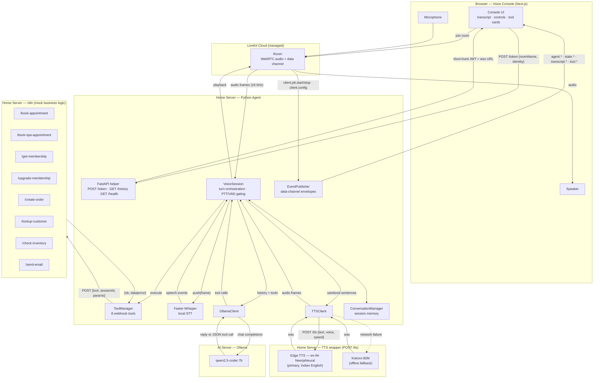
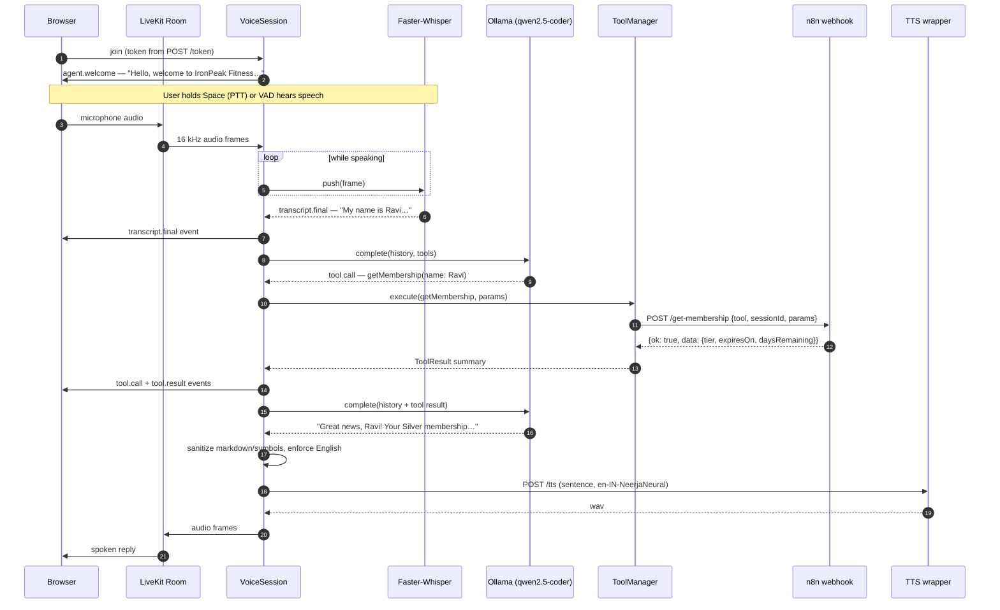

# AI Voice Agent

A realtime voice assistant that runs in the browser: you talk, a Python agent
transcribes locally, reasons with Ollama, delegates business operations to n8n
webhooks, and speaks back — all streamed over **LiveKit Cloud**.

```
Browser → LiveKit Cloud → Python Agent (Home Server)
        → Faster-Whisper → Ollama (AI Server) → [n8n webhooks] → Ollama
        → Edge TTS (en-IN, Kokoro fallback) → LiveKit Cloud → Browser
```

## Components

The system is built for a distributed setup with three components. Clone the
same repository where you need it; each component uses only its own folders.

### 1. LiveKit Cloud (managed)

The realtime transport — **managed by LiveKit, nothing to host**. It handles
only WebRTC, audio transport, room management, and participant management.
It does **not** run AI, STT, TTS, or business logic.

The application connects to it with `LIVEKIT_URL`, `LIVEKIT_API_KEY`,
`LIVEKIT_API_SECRET`. The browser receives a short-lived token generated by
our backend (`POST /token`) and never knows the API secret. See
`livekit/README.md` for where to get these values.

### 2. Home Server (application server)

The orchestration server. Runs the entire conversation pipeline:

| Folder | Purpose |
|---|---|
| `agent/` | Python LiveKit agent: session orchestration, FastAPI helper (token + history), clients (Whisper, Ollama, Kokoro, n8n), tool manager |
| `shared/` | Cross-module contracts the agent consumes |

Also hosts (already installed, not recreated): **n8n**, **PostgreSQL**,
**Redis**. Faster-Whisper and Kokoro run **in-process / locally on this
machine**. The agent owns: conversation state, session state, tool calling,
the LiveKit connection, and communication with Whisper, Ollama, Kokoro, and
n8n.

### 3. AI Server

Dedicated to **Ollama only**. Nothing else belongs here; there is no code or
folder for this machine in the repo. It exposes an OpenAI-compatible HTTP API
reachable from the Home Server's **local LAN IP** (e.g.
`http://192.168.x.x:11434`) — never assume localhost. The URL comes from the
`OLLAMA_BASE_URL` environment variable.

## Architecture



The browser never communicates directly with Ollama, Whisper, the TTS engine,
PostgreSQL, Redis, or n8n. The Python Agent is the only orchestration layer.
LiveKit secrets exist only on the agent (Home Server); the browser receives a
short-lived JWT from the agent's `POST /token`.

## How a conversation works



### Step by step

1. **Join** — the browser requests a short-lived LiveKit token from the agent's
   `POST /token`, then connects to a room on LiveKit Cloud. The agent joins the
   same room as the `voice-agent` participant.

2. **Greeting** — the agent publishes `agent.welcome` ("Hello, welcome to
   IronPeak Fitness…") over the data channel, which the browser speaks and shows
   as the first transcript line.

3. **Listen** — the user holds **Space** (push-to-talk) or has **Voice
   activity** enabled. Audio is gated at the session level: in PTT mode nothing
   reaches the STT until the button/key is held; on release, buffered audio is
   flushed and processed. Mic frames stream into Faster-Whisper (in-process,
   16 kHz mono), producing `transcript.partial` events live and a
   `transcript.final` when the utterance ends.

4. **Think** — `VoiceSession` runs a turn: it appends the user text to
   conversation memory and calls Ollama (`qwen2.5-coder:7b`) with the full
   history plus the registered tool schemas. The model either answers directly
   or returns a tool call (written as JSON text, which the client parses).

5. **Act** — if a tool call comes back, the `ToolManager` executes it: an
   `{ok, data|error}` envelope is POSTed to the matching n8n webhook
   (booking, membership, upgrade, order, inventory, email — all mock). The
   result is appended to the history and the model is called again, up to
   `MAX_TOOL_ROUNDS` times, until it answers plainly. The frontend renders
   `tool.call` / `tool.result` as live execution cards with latency.

6. **Reply** — the final answer is stripped of markdown, symbols and emoji,
   then streamed sentence-by-sentence to the TTS wrapper. Primary voice is
   Microsoft Edge TTS (`en-IN-NeerjaNeural`, Indian English); if the network
   call fails the wrapper falls back to local Kokoro-82M so the agent always
   speaks. Audio frames are published back through LiveKit and played in the
   browser while `state.*` events drive the UI indicators.

7. **Remember** — the session keeps the conversation (including the member's
   name) in `ConversationManager`; history is retrievable via
   `GET /history/{sessionId}`.

## Demo guide: what you can ask the voice agent

The agent is **Maya**, the IronPeak Fitness receptionist. Everything below works
live — the tools are real webhook calls (the business data is mock, but the
behaviour is production-shaped).

### Capabilities at a glance

| Function | What it does | Try saying |
|---|---|---|
| **Member profile** | The moment you say your name, the agent loads your full profile: membership tier, expiry, visits and **upcoming bookings** — no repetition needed | "My name is Sarah" → *"Hello Sarah! Welcome back…"* then "What do I have booked?" |
| **Gym booking** | Book classes and personal training | "Book a personal training session for Friday" |
| **Spa booking** | Book massages, saunas, facials | "Book a Swedish massage for tomorrow afternoon" |
| **Cancellations** | Cancel one or all bookings | "Cancel all my bookings" |
| **Membership** | Tier, status, expiry date, days left | "When does my membership expire?" |
| **Upgrades** | Move to Gold or Platinum | "Upgrade me to Platinum" |
| **Orders** | Buy merchandise (shakes, bands, tees…) | "Order two protein shakes and a gym tee" |
| **Availability** | Equipment/facility stock and availability | "Is the sauna available tomorrow morning?" |
| **Email** | Send confirmations or info by email | "Email me today's class schedule" |
| **Renewal nudge** | When a membership expires within 30 days, Maya mentions it once and offers to renew | Use the name **Ravi** — his mock membership expires in 3 days |

### The 2-minute demo script

Run this top to bottom in front of a client:

1. **The hook** — *"Hi, my name is Ravi."* → Maya auto-fetches his profile and
   warns him his membership expires in **3 days**, offering to renew. (Shows
   memory + proactive retention.)
2. **The booking** — *"Book me a Swedish massage for tomorrow afternoon."* →
   confirmed with therapist and time, by name. (Shows real webhook execution.)
3. **The membership** — *"How much to upgrade to Platinum?"* → answers from the
   profile and offers the upgrade. (Shows the upsell path.)
4. **The multi-task turn** — *"Book a yoga class on Friday, order two resistance
   bands, and check if you have a 16kg kettlebell."* → three tools executed in
   one conversation. (Shows orchestration.)
5. **The cancellation** — *"Cancel all my bookings."* → cleanly cancels, no
   questions about which ones. (Shows the full service loop.)
6. **The graceful failure** — *"Book me a shark-wrestling session."* → Maya
   politely says she can't and offers the spa instead. (Shows honest AI
   behaviour — no fabricated success.)

### What this demonstrates to a client (business value)

- **24/7 front desk** — a receptionist that never sleeps: bookings,
  cancellations and membership questions handled without staff.
- **Member self-service** — the member never repeats themselves; the agent
  pulls their record the moment they give their name.
- **Revenue moments** — spa bookings, membership upgrades and merchandise
  orders are all conversational upsell opportunities.
- **Retention** — proactive renewal warnings before memberships lapse.
- **Operational** — live availability and inventory answers; confirmations
  emailed automatically.
- **Honest AI** — graceful "I can't do that" handling instead of hallucinated
  success, and a real-time voice pipeline (STT → LLM → business logic → TTS).

### Demo tips

- Say your **name early** — the profile lookup and name-remembering are the
  showpiece features; they only fire once she knows who you are.
- Hold **Space** to talk (push-to-talk is the default); toggle **Voice
  activity** for hands-free.
- Names are deterministic mock data: **Ravi** (expires in 3 days — renewal
  hook), **Sarah** (Silver, 31 days, 2 upcoming bookings), **Alice** (Gold,
  25 days).
- Keep each utterance to one or two requests for maximum reliability.

## Repository layout

| Folder | Used by | What it is |
|---|---|---|
| `frontend/` | any machine with a browser / dev host | Next.js voice console (README inside) |
| `livekit/` | reference only | LiveKit Cloud connection values (README inside) |
| `agent/` | Home Server | Python agent + FastAPI helper (README inside) |
| `shared/` | Home Server (via agent); referenced by frontend | Canonical contracts: `schemas/`, `contracts/`, `types/`, `configuration/env-conventions.md` |
| `docs/` | any | Architecture, API, webhook integration, project overview |

## Startup order

1. **Create the LiveKit Cloud project** and note `LIVEKIT_URL` + API
   key/secret (`livekit/README.md`).
2. **Start the Python Agent on the Home Server** (`cd agent` → follow
   `agent/README.md`) — it connects to LiveKit Cloud and exposes `POST /token`
   on `AGENT_HOST:AGENT_PORT`.
3. **Ensure Faster-Whisper and Kokoro are running on the Home Server**
   (Whisper loads in-process; Kokoro must expose its HTTP wrapper on
   `TTS_BASE_URL`).
4. **Verify connectivity to the Ollama server over the LAN**:
   `curl http://192.168.x.x:11434/v1/models` from the Home Server; set
   `OLLAMA_BASE_URL` to that LAN address in `agent/.env`.
5. **Start the frontend** (`cd frontend` → follow `frontend/README.md`):
   `npm install`, `npm run build`, `npm run start`.
6. **Open the application in the browser**, press Connect, and verify the
   full conversation flow (transcript, tool calls, audio reply).

## Configuration

Environment variables are **separated by component** — never mixed:

- `frontend/.env.example` — browser-side URLs
- `agent/.env.example` — LiveKit Cloud, Ollama (LAN), Whisper, Kokoro, n8n webhooks, logging
- `livekit/.env.example` — LiveKit Cloud connection values shared with the other two

Canonical names and defaults: `shared/configuration/env-conventions.md`.

## Quick reference

```bash
# Home Server — agent
cd agent && cp .env.example .env             # fill LIVEKIT_* (Cloud), OLLAMA_BASE_URL (LAN), N8N_WEBHOOK_BASE_URL
pip install -e . && agent-run                # agent API on :8080

# Frontend (dev machine or Home Server)
cd frontend && cp .env.example .env.local    # NEXT_PUBLIC_LIVEKIT_URL (Cloud) + NEXT_PUBLIC_AGENT_API_URL
npm install && npm run build && npm run start

# AI Server — already running Ollama; verify from Home Server:
curl http://192.168.x.x:11434/v1/models
```

## Documentation

- [docs/ARCHITECTURE.md](docs/ARCHITECTURE.md) — full pipeline, module responsibilities, session lifecycle
- [docs/API.md](docs/API.md) — FastAPI surface + data-channel event reference
- [docs/WEBHOOKS.md](docs/WEBHOOKS.md) — n8n integration, example payloads, adding tools
- [docs/PROJECT_OVERVIEW.md](docs/PROJECT_OVERVIEW.md) — goals, constraints, extension points
- `shared/` — the source-of-truth contracts (schemas, env conventions, webhook shapes)
